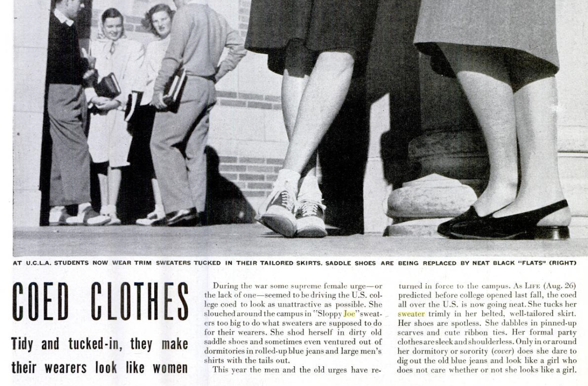
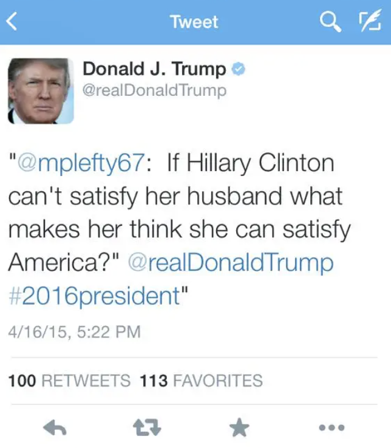
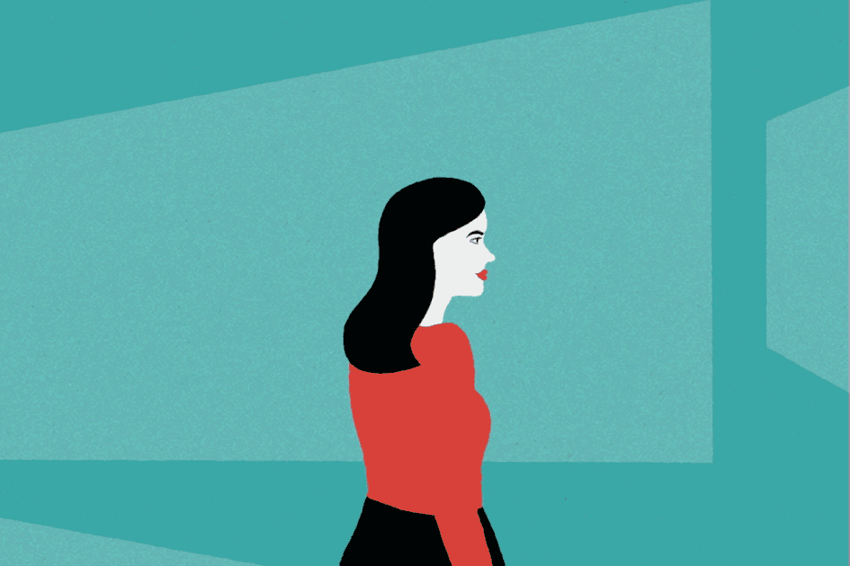
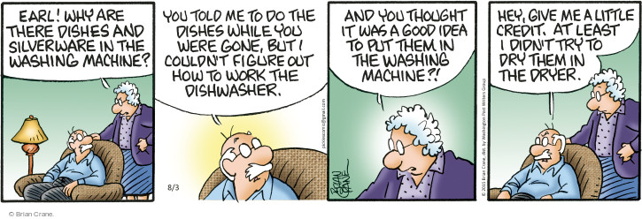
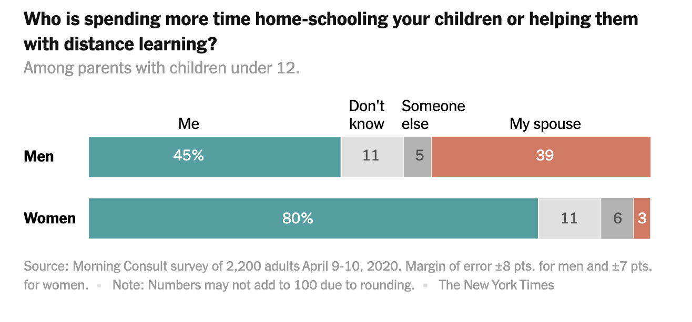

+++
title = "Pudenda Agenda"
outputs = ["Reveal"]
+++

# pudenda

a person's external genitals, especially a woman's—in Latin meaning ["to be ashamed of"](https://www.nytimes.com/2020/10/26/us/childbirth-bodies-stigma-incontinence.html)

---

Life Magazine, 24 Feb 1947 (read me)

---

{}

---

# Rules of Being a Lady:

"The spirit of politeness consists in certain attention to forms and ceremonies, which are meant both to please others and ourselves, and to make others pleased with us."

---
A polite lady must...

# "Be self-sacrificing, friendly, unselfish."

---

"Be careful in conversation to avoid topics which may be supposed to have any direct reference to events or circumstances which may be painful for your companion to hear discussed."

---

"Never anticipate the point or joke of any anecdote told in your presence."

---

# Now available on[ Amazon!](https://www.amazon.com/gp/product/B00TCZTHYY/ref=as_li_tl?ie=UTF8&camp=1789&creative=390957&creativeASIN=B00TCZTHYY&linkCode=as2&tag=socialearn02-20&linkId=4ILYIO4YBGQPNSGB)

"Florence Hartley's insightful etiquette guide was first published in 1860, and yet her witty and useful advice on behaving like a lady often still rings true down the ages..."

{}

---
# Bitch

literally meaning a female dog, a pejorative slang word for a person — usually [a woman — who is belligerent, unreasonable, malicious, controlling, aggressive, or dominant.](https://en.wikipedia.org/wiki/Bitch_(slang)#:~:text=Bitch%2C%20literally%20meaning%20a%20female,%2C%20weak%2C%20or%20cowardly%20man.) When applied to a man, bitch reverses its meaning and is a derogatory term for a subordinate, weak, or cowardly man.

---

High-achieving women experience social backlash because their very success – and specifically the behaviors that created that success – violates our expectations about how women are supposed to behave. Women are expected to be nice, warm, friendly, and nurturing. 
 
As descriptions like “Ice Queen,” and “Ballbuster” can attest, we are deeply uncomfortable with powerful women. In fact, we often don’t really like them.

[Harvard Business Review](https://hbr.org/2013/04/for-women-leaders-likability-a)

---

{}
"She is extraordinarily nasty." - [Trump](https://www.nbcnews.com/politics/2020-election/phony-kamala-trump-campaign-responds-harris-vp-pick-n1236467)

Also: "So angry" and "the meanest." 

---

---

# gender judo

I have [interviewed](https://www.nytimes.com/2019/08/16/opinion/sunday/gender-bias-work.html) about 200 women over the years in my research on gender and the workplace, and they all employ a similar set of strategies for escaping the likability trap. One former chief executive described hers this way: “I’m warm Ms. Mother 95 percent of the time, so that the 5 percent of the time when I need to be tough, I can be.”

---

What if you, [like me](https://www.nytimes.com/2019/08/27/us/likability-penalty.html), just don’t have the energy to engage in all that judo all day long?

{}

---
{}

It’s a concrete [fact](https://hbr.org/2018/06/research-women-ask-for-raises-as-often-as-men-but-are-less-likely-to-get-them#:~:text=The%20true%20gender%20pay%2Dgap,likely%20to%20negotiate%20their%20salaries) that women earn less than men do. The true gender pay-gap is not known with certainty, but, when comparing equally qualified people doing the same job, most estimates by labor economists put it at 10% – 20%. 

---
# That's becauase women don't negotiate
Women who [initiate negotiations](https://gap.hks.harvard.edu/social-incentives-gender-differences-propensity-initiate-negotiations-sometimes-it-does-hurt-ask) in the workplace are more likely to be penalized than their male counterparts.

{}

---

{}

"If American women earned minimum wage for the unpaid work they do around the house and caring for relatives, they would have made [$1.5 trillion](https://www.nytimes.com/interactive/2020/03/04/opinion/women-unpaid-labor.html) last year."

---

American stand-up comedian
# Dave Chappelle

“Her face was looking like, ‘He might be right.’ I saw that, I said, ‘Ooh, that’s why, that’s why women make half.' (audience groans) Did I trigger you? I don’t know what it is. Half, maybe 70 percent, whatever it is, it’s too much. I’m sorry, Lorne, I thought we were having a comedy show.” 

---

In the U.S., women spend around four hours a day on unpaid work compared with men’s 2.5  hours according to data from the [Organization for Economic Cooperation and Development](https://stats.oecd.org/index.aspx?queryid=54757). Those hours add up to 10.5 more hours per week and 546 more hours per year. 

---

“These are hours that could be spent on income generation,” [says Nahla Valji](https://www.nytimes.com/2020/05/20/us/women-economy-jobs-coronavirus-gender.html), the senior gender adviser to the Secretary General of the United Nations. “It’s at the heart of the ‘motherhood penalty,’ wage inequality, structural biases in recruitment, and promotion of women and jobs.”

---

[COVID 2020](https://www.nytimes.com/2020/05/06/upshot/pandemic-chores-homeschooling-gender.html)

---

Popular American sportscaster on ABC
# Dale Hansen

“If you have a woman — like a co-anchor or a news director, or station manager — I think it’s a fantastic day because they work cheaper, so that leaves more money for you and me,” Dale Hansen said on air, talking with meteorologist Pete Delkus. 

[(Oct 2020)](https://www.distractify.com/p/what-did-dale-hansen-say)

---

[70 percent of women said they were fully or mostly responsible for housework during lockdown.](https://www.nytimes.com/programs/womens-issues/day-2)

"With children out of school, day cares closed, community centers and camps shuttered, and the needs of the elderly and sick magnified, the responsibilities fell where they almost always do: on the shoulders of women. But this time the work wasn’t so easily ignored as male partners were on lockdown, too. Did it make a difference? Not so much."

{}

---

In its [2017 Commission on the Status of Women](https://www.un.org/ga/search/view_doc.asp?symbol=E/CN.6/2017/3), the U.N. noted, “unpaid care and domestic work supports the economy and often makes up for lack of public expenditure on social services and infrastructure. In effect, it represents a transfer of resources from women to others in the economy.” 
