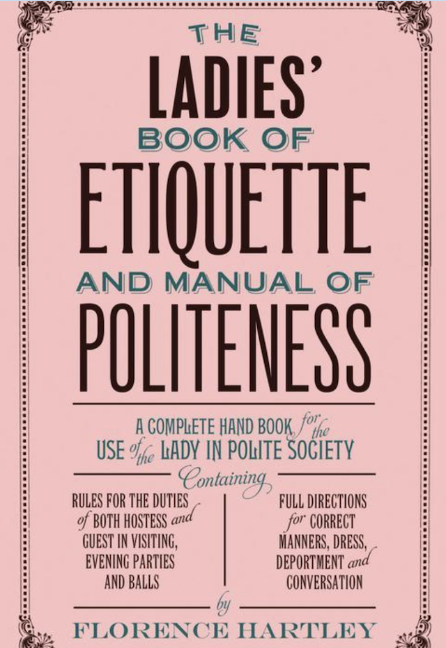

+++
title = "My presentation"
outputs = ["Reveal"]
+++

# pudenda

a person's external genitals, especially a woman's—in Latin meaning ["to be ashamed of"](https://www.nytimes.com/2020/10/26/us/childbirth-bodies-stigma-incontinence.html)

---
# Life Magazine, 24 Feb 1947

---
{}

---
# Rules of Being a Lady"

"The spirit of politeness consists in certain attention to forms and ceremonies, which are meant both to please others and ourselves, and to make others pleased with us."

---
A polite lady must...

# "Be self-sacrificing, friendly, unselfish."

---

"Be careful in conversation to avoid topics which may be supposed to have any direct reference to events or circumstances which may be painful for your companion to hear discussed."
---

"Never anticipate the point or joke of any anecdote told in your presence."
---

{}